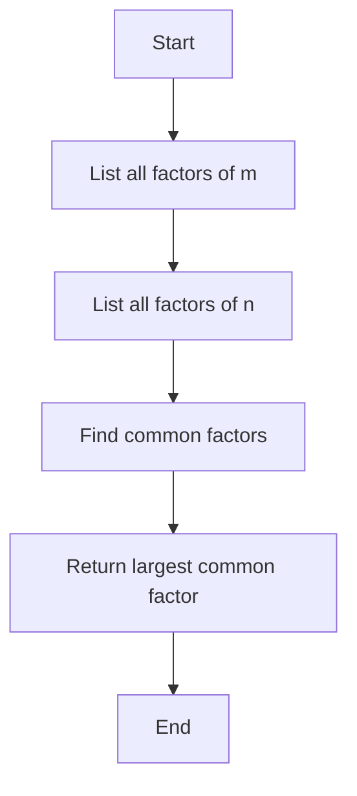
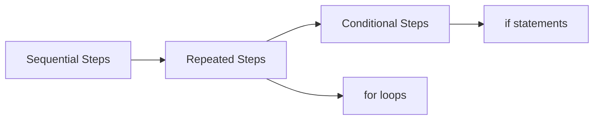

# Programming, Data Structures and Algorithms in Python - Week 1, Lecture 1

## Overview
This lecture introduces the fundamental concepts of algorithms and programming, using Python as the implementation language. The course focuses on algorithms that manipulate information and organize data efficiently.

## What is an Algorithm?

An **algorithm** is a systematic way to perform a task, written as a sequence of steps - essentially a "recipe" or program. Key characteristics:

- **Finite presentation**: The algorithm must be written down in a finite way
- **Finite termination**: Must complete after a finite number of steps
- **Level of detail**: Steps depend on the executor's capabilities (e.g., "arrange chairs" vs "make 8 rows with 10 chairs each")

## Types of Algorithms Covered

The course focuses on algorithms that manipulate information:

1. **Numerical computations**: Calculate functions like f(x,y) = x^y
2. **Data reorganization**: Sort data in ascending/descending order
3. **Optimization**: Find shortest routes, minimum costs
4. **Complex applications**: Solve Sudoku, play chess, correct spelling

## Example: Greatest Common Divisor (GCD)

### Definition
The GCD of two positive integers m and n is the largest number k such that:
- k divides m (with no remainder)
- k divides n (with no remainder)

Examples:
- gcd(8, 12) = 4
- gcd(18, 25) = 1

### Basic Algorithm Approach



### Detailed Algorithm Steps

1. **Find factors of m**: Test each number from 1 to m
2. **Find factors of n**: Test each number from 1 to n  
3. **Find common factors**: Check which factors appear in both lists
4. **Return the largest**: The rightmost value in the common factors list

### Example Walkthrough: gcd(14, 63)

**Step 1: Factors of 14**
- Test: 1, 2, 3, 4, 5, 6, 7, 8, 9, 10, 11, 12, 13, 14
- Factors: 1, 2, 7, 14

**Step 2: Factors of 63**
- Test: 1, 2, 3, ..., 63
- Factors: 1, 3, 7, 9, 21, 63

**Step 3: Common factors**
- Compare lists: 1 and 7 appear in both

**Step 4: Result**
- Largest common factor = 7

## Python Implementation

```python
def gcd(m, n):
    # Find factors of m
    fm = []
    for i in range(1, m+1):
        if (m % i) == 0:
            fm.append(i)
    
    # Find factors of n
    fn = []
    for j in range(1, n+1):
        if (n % j) == 0:
            fn.append(j)
    
    # Find common factors
    cf = []
    for f in fm:
        if f in fn:
            cf.append(f)
    
    # Return largest common factor
    return cf[-1]
```

### Key Python Concepts Introduced

1. **Function definition**: `def gcd(m, n):`
2. **Lists**: Empty list `[]`, append with `.append()`
3. **Range function**: `range(1, m+1)` gives 1 to m
4. **Modulo operator**: `%` for remainder
5. **Conditional statements**: `if` condition
6. **For loops**: Iterate through ranges and lists
7. **List indexing**: `cf[-1]` gets the last element

## Programming Concepts

### 1. Names and Values
- **Single values**: m, n, i, j, f (individual numbers)
- **Collections**: fm, fn, cf (lists of numbers)
- Names store intermediate values for later use

### 2. Assignment and Updates
- **Explicit assignment**: `fm = []`
- **Implicit assignment**: `for f in fm:` (assigns each value to f)
- **Updates**: `fm.append(i)` modifies existing list

### 3. Control Flow



- **Sequential**: Execute steps in order
- **Repeated**: Use loops (`for` statements)
- **Conditional**: Execute only if condition is true (`if` statements)

## Important Observations

1. **Data Structures**: Collections (like lists) allow us to handle variable amounts of data without creating individual names for each value

2. **Indentation**: Python uses indentation to show code blocks (inside loops and conditions)

3. **Efficiency Note**: This is a naive algorithm - more efficient methods exist for computing GCD

## Summary

This lecture establishes the foundation for understanding:
- What algorithms are and how they work
- How to translate algorithms into Python programs
- Basic programming constructs (variables, lists, loops, conditions)
- The importance of organizing data (data structures)


The GCD example demonstrates how a mathematical concept can be systematically implemented as a computer program, introducing fundamental programming concepts that will be built upon throughout the course.
